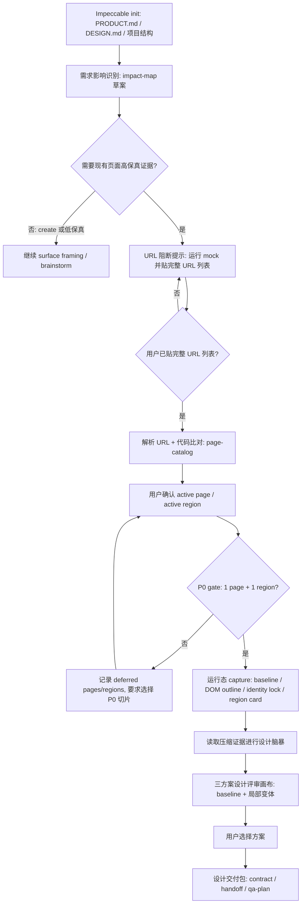

# BFDS 运行态证据与多页面影响图实施计划

## Summary

本计划解决 BFDS 问题 4：在已有页面做局部增删改时，`bfds-design` 生成的 A/B/C 方向校准物不能重画整页，未变区域必须来自当前运行页面的真实证据，并保持现有样式、布局和设计语气。

方案采用“多页面协议、单页面 P0 执行门禁”：数据结构从第一版支持一个需求影响多个页面和多个区域，但 P0 只放行一个 active 页面、一个 active 目标区域的局部增删改。高置信局部方案预览必须先获得运行态页面证据；没有证据时硬停止或标记为低置信草图，不生成伪高保真方案。

本计划服务于 `BFDS 设计规范驱动生码闭环实施计划` 的新主线：`DESIGN.md` 是唯一设计规范事实源，运行态证据用于保护现有页面身份和局部边界，A/B/C 仍是生码方向校准物，最终高保真闭环发生在真实代码实现、自审和局部实时微调阶段。

---

## Problem Frame

BFDS 当前流程是：先通过 Impeccable `init` 建立 `PRODUCT.md` 和 `DESIGN.md`，再从 PRD、原型、截图、Figma、URL 或现有页面中确认目标界面与变更边界，随后做设计脑暴，生成 A/B/C 三个 HTML 方案，用户选择后固化设计交付包。

这个流程在新建页面或低保真设计探索中可用，但在公司内部项目里跑“修改现有页面局部区域”的需求时暴露出严重问题：三方案 HTML 经常把页面其他内容一起重画，未变区域没有保持当前页面的样式和设计。用户真正需要的是“页面里某个区域的组件更新，其他内容不变”，但当前产物容易变成“模型重新想象了一整个页面”。

这个问题不能靠把 workbench 做得更漂亮解决。画布式评审工作台能降低 PD、设计师和开发共同看稿的理解成本，但如果底层没有运行态证据、目标区域定位、身份锁和未改区域锁定，画布只会把错误包装得更精致。

---

## Company Context

公司内部使用场景有这些约束：

- 项目通常需要先运行 mock 服务，例如运行 `nxb-h5-mock` 或在对应项目里运行 `tnpm run mock`。
- 一个项目可能有多个页面入口，例如 `index.html`、`demo.html`、`user.html`，一个需求也可能涉及多个页面的新增、删除或修改。
- 页面 host 不能由 BFDS 猜测。host 可能来自 mock 服务输出、用户本地端口、内网页面或特殊代理地址。
- 公司内部网络环境封闭，Playwright 下载 Chromium 或安装浏览器依赖不一定可靠。
- 内部模型多模态能力一般，若把多页面截图、完整 DOM 和长结构一次性塞进上下文，极容易耗尽 token、时间和服务承载能力。
- 用户更愿意提供自由文本页面列表，而不是手写结构化 JSON。

因此 BFDS 需要把“页面启动、URL 确认、运行态抓取、证据压缩、局部生成”拆成明确阶段，不能在设计脑暴或 HTML 生成时临时猜页面。

---

## Current BFDS State

现有能力与缺口如下：

- `skills/bfds-design/references/surface-change-framing.md` 已要求确认目标界面、现状来源、改动类型、必须保留、允许改变、必须避免，并规定 `modify/remove/replace/restyle` 需要视觉证据或用户确认。
- `skills/bfds-design/references/workbench-authoring.md` 已规定三方案来自 `evidence/directions.json`，iframe 内设计稿服从目标项目 `DESIGN.md`，但没有规定局部改动时未变区域必须来自 baseline。
- `src/adapters/impeccable/README.md` 已规定 BFDS 复用 Impeccable `init`、`detect`、`critique`、`live`，并且不 fork `vendor/impeccable/`。
- 当前 `surface.json` 里的 `keep/change/avoid` 主要是文字约束，尚未变成可执行的页面证据、目标区域、锁定区域和校验规则。
- 当前设计交付包 schema 以单个 `surface` 为中心，尚未表达多页面影响图、页面证据包、目标区域和允许影响区。

核心缺口是：BFDS 目前能问“哪些要保留”，但不能确定性地让模型只改目标区域，也不能校验未改区域是否保留。

---

## Conversation Notes For Problem 4

本节提取本次围绕问题 4 的关键讨论，供后续审查模型理解决策来源。

- 用户指出一个严重 case：本次需求只是更新页面某个区域的组件，页面其他内容不变。理论上三方案 HTML 中不变区域应与当前页面保持相同样式和设计，但自测发现完全没有，都是乱生成。
- 初步讨论过“画布式三方案评审工作台”，它能解决“HTML 给 PD、设计师、开发看起来像工程表格”的问题，但不能自动解决未变区域被重画的问题。
- 进一步结论是：问题 4 的本质不是 workbench 视觉，而是局部修改时必须有运行态页面证据、目标区域定位、identity lock 和 locked regions。
- 用户认为真高保真应从代码运行后的页面出发，LLM 抓取结构和页面，而不是凭 PRD 或代码静态推断。
- 讨论过 Playwright，但用户担心安装重、上下文重、耗时重，且公司内网封闭，Playwright 成功安装不可靠。
- 更轻方案是借鉴 Impeccable live：页面内注入 capture script，在用户真实浏览器和真实 mock 页面里抓 DOM、computed style、CSS variables、bounding rect、目标元素、父级/兄弟结构和截图。
- 用户确认 P0 可以只测试单页面，但方案设计必须按多页面增删改来建模，避免未来推倒重来。
- 用户确认：P0 只支持单页面、单目标区域、局部增删改；页面抓取优先 `capture script / Impeccable live`，CDP 可选，Playwright 只做可选 adapter；没有运行态证据时可以硬停止；多页面需求在 P0 先生成影响图并让用户选择一个主页面，其余 deferred。
- 用户进一步要求 URL 流程必须阻断：提示“请先运行 nxb-h5-mock 或在对应项目里运行 tnpm run mock，并把完整URL列表贴给我”，用户贴出完整 URL 列表后才能继续。

---

## Requirements

- R1. BFDS 必须先按多页面模型识别需求影响范围，再进入运行态证据抓取；P0 只允许一个页面、一个目标区域进入高保真流程。
- R2. 当任务需要运行态证据时，BFDS 必须阻断并提示用户：`请先运行 nxb-h5-mock 或在对应项目里运行 tnpm run mock，并把完整URL列表贴给我`。用户未贴完整 URL 列表前，不能继续页面抓取、脑暴或生成高保真 HTML。
- R3. BFDS 不得猜测页面 host。host 只能来自用户粘贴的完整 URL、用户粘贴的 mock 输出，或代码推断后的用户确认。
- R4. 用户贴回 URL 列表后，BFDS 需要从代码中比对这些 URL 对应的文件或路由，并给出 `high/medium/low` 置信度。
- R5. P0 impact-map 必须允许记录多个页面，但 gate 只放行一个 active page 和一个 active region；其他页面记录为 deferred。
- R6. 运行态抓取的主方案应是页面内 capture script 或 Impeccable live 风格注入；CDP 和 Playwright 只能作为可选 adapter。
- R7. LLM 热上下文只能读取压缩后的 `page-card`、`region-card`、`identity-lock` 和必要摘要，不得读取完整 DOM、大量截图或完整页面源。
- R8. 对 `modify/remove/replace/restyle` 的高保真设计，未改区域必须来自 baseline 截图或真实页面结构，不允许 LLM 自由生成。
- R9. Workbench 应表达“当前页面基底 + 目标区域热点 + A/B/C 局部变体 + inspector”，而不是把区域拆解表作为主视图。
- R10. 没有运行态证据、URL 未确认、目标区域无法定位或允许影响区不明确时，BFDS 必须硬停止或降级为低置信草图，不能标记为高置信局部方案预览。
- R11. 设计交付包必须记录页面 URL、目标区域、允许影响区、锁定区域、baseline 证据和 identity lock，使 `bfds-implement` 不需要翻聊天记录。

---

## Key Technical Decisions

- KTD1. 多页面协议、单页面执行门禁：协议使用 `pages[]` 和 `regions[]`，P0 gate 只放行 `pages.filter(page => page.status === "active").length === 1`，且 active 页面的 active region 恰好一个；其他页面和区域必须记录为 `deferred`。这样初期执行简单，后续多页面扩展不需要重写数据模型。
- KTD2. URL 阶段必须阻断：用户没有贴完整 URL 列表前，不允许进入运行态抓取和高保真生成。URL 是运行态证据的入口，不是模型可猜测字段。
- KTD3. 轻量 capture 优先于 Playwright：公司内网和模型能力约束下，页面内注入脚本比 Playwright 更可靠。它复用用户真实浏览器、真实登录态、真实 mock 服务和浏览器原生 API。
- KTD4. 证据落盘、摘要入上下文：完整 DOM、截图和结构证据写入 `docs/design/<slug>/evidence/pages/`；模型只读压缩摘要。减轻 token、时间和多模态负担。
- KTD5. 三方案是整体方向，不是页面排列组合：多页面未来支持时，A/B/C 表示三个整体设计方向，每个方向覆盖受影响页面的 per-page delta，避免 `页面数 x 方案数` 的组合爆炸。
- KTD6. Locked regions 是生成约束也是验收约束：未改区域不只是文案里的 keep，而是 workbench 生成和后续 QA 都要使用的明确区域。
- KTD7. 不修改 `vendor/impeccable/`：BFDS 只在 adapter、runtime 和 skill references 层复用 Impeccable 思路与脚本入口，保持 vendor upstream-compatible。

---

## High-Level Technical Design



### Data Shape

`impact-map` 是需求影响图，表示“本次需求可能影响哪些页面和区域”。P0 只激活其中一个页面和一个区域。

```json
{
  "pages": [
    {
      "id": "user-page",
      "url": "http://127.0.0.1:8080/user.html",
      "path": "/user.html",
      "pageRole": "用户页",
      "changeType": "modify",
      "routeConfidence": "high",
      "status": "active",
      "regions": [
        {
          "id": "risk-tag-region",
          "changeType": "extend",
          "editableRegion": "持仓列表风险标签区域",
          "allowedImpactZone": "持仓列表行内标签和相邻列宽",
          "lockedRegions": ["顶部导航", "筛选栏", "底部分页"],
          "priority": "primary"
        }
      ]
    }
  ]
}
```

页面证据包按页面分目录，避免把所有证据塞进单个文件：

```text
docs/design/<slug>/evidence/pages/<page-id>/
  page-card.json
  baseline.png
  dom-outline.json
  identity-lock.json
  regions/<region-id>.json
```

`page-card.json` 是 LLM 热路径读取的压缩摘要，`dom-outline.json` 和 `baseline.png` 是冷路径证据，只有卡片要求时读取。`identity-lock.json` 固定当前页面的颜色、字体、圆角、边框、阴影、密度和组件语气。`regions/<region-id>.json` 记录目标区域、父级/兄弟结构、bounding rect、outerHTML 摘要和允许影响区。

### URL Handling

URL 处理必须区分三个概念：

```text
host/origin:
  http://127.0.0.1:8080

page path:
  /index.html
  /demo.html
  /user.html
  /#/user/detail

full URL:
  http://127.0.0.1:8080/user.html
```

BFDS 不猜 host。需要高保真运行态证据时，next-card 必须阻断并输出：

```text
请先运行 nxb-h5-mock 或在对应项目里运行 tnpm run mock，并把完整URL列表贴给我
```

用户可以贴：

```text
http://127.0.0.1:8080/index.html
http://127.0.0.1:8080/demo.html
http://127.0.0.1:8080/user.html
```

BFDS 解析完整 URL 后，再从代码中比对：

- `/index.html` 直接对应文件，置信度 high。
- `/demo.html` 直接对应文件，置信度 high。
- `/#/user/detail` 需要查路由或运行态确认，置信度 medium。
- 代码中找不到的 URL 只能记录为 low，并要求用户确认。

### Capture Adapter

P0 capture adapter 优先使用页面内脚本：

- 在真实页面中运行，使用用户真实浏览器、真实 mock 服务、真实登录态。
- 用浏览器原生 API 抓 `document`、`getComputedStyle`、`getBoundingClientRect`、CSS variables、目标元素、父级和兄弟结构。
- 用页面内截图能力抓 baseline 和目标区域截图，可复用 Impeccable live 的 `modern-screenshot` 经验。
- 不把完整截图和完整 DOM 直接交给 LLM；runtime 先压缩成 `page-card` 和 `region-card`。

CDP 和 Playwright 仅作为后续增强：

- CDP：连接用户已经启动的 Chrome remote debugging，适合更自动化的抓取，但不作为 P0 必需能力。
- Playwright：可作为外部环境允许时的 adapter，但不能成为 BFDS 高保真能力的必需依赖。

### Workbench Shape

局部改动的 workbench 不再以“区域 1/2/3 表格”作为主视图。主视图应是：

- 左侧：页面列表和影响图。P0 只有一个页面，多页面时自然扩展。
- 中间：当前页面画布，以 baseline 为基底。
- 右侧：当前目标区域、锁定区域、允许影响区、实现说明。
- 底部或顶部：方案 A/B/C 切换。

对修改、删除、替换、局部新增：

- 目标区域显示 A/B/C 局部变体。
- 未改区域使用 baseline 或真实页面 shell 表达。
- 删除场景使用 before/after 或回流示意，但只允许影响区变化。
- 插入场景显示插入点和邻域变化，页面其他区域锁定。

---

## Scope Boundaries

### P0

- 支持一个 active page。
- 支持一个 active region。
- 支持 `modify`、`remove`、`replace`、`extend` 的局部设计。
- 需要用户粘贴完整 URL 列表。
- 需要运行态证据才能生成高置信局部方案预览。
- 多页面、多区域只进入 impact-map，非 active 项记录为 deferred。

### Deferred

- 一个页面多个区域的同时高保真设计。
- 多页面完整高保真 workbench。
- 自动启动 mock 服务。
- Playwright adapter。
- CDP adapter。
- masked visual diff 自动化阈值。
- 从 PRD 自动发现全部页面并自动确认 URL。

### Non-goals

- 不把 BFDS 扩展成通用前端框架。
- 不让用户手写 `impact-map`、`identity-lock` 或 schema JSON。
- 不修改 `vendor/impeccable/`。
- 不在 skill 目录新增 README、术语表或长文档。
- 不用 Playwright 作为必需依赖。

---

## Implementation Units

### U1. Runtime 状态机增加运行态证据阶段

- **Goal:** 在 `NEEDS_SURFACE` 和 `NEEDS_DIRECTIONS` 之间增加 URL 阻断和页面证据阶段。
- **Files:** `src/runtime/bfds/cli.mjs`, `src/runtime/bfds/scripts/bfds-gate.mjs`, `src/runtime/bfds/scripts/validate-artifacts.mjs`.
- **Behavior:** 当 change type 需要现有页面高保真证据且缺少 URL 列表时，next-card 输出固定阻断提示，并禁止进入脑暴和 workbench。
- **Test Scenarios:** 没有 URL 列表时停在证据阶段；用户提交 URL 列表后进入影响图确认；P0 超过一个 active page 或 active region 时继续阻断。

### U2. 新增多页面影响图 schema 和证据目录校验

- **Goal:** 用 `impact-map` 表达多页面、多区域需求影响范围，同时让 P0 gate 只放行一个页面一个区域。
- **Files:** `src/runtime/bfds/schemas/`, `src/runtime/bfds/scripts/validate-artifacts.mjs`, `fixtures/docs-design-sample/settings-prompt/evidence/`.
- **Behavior:** 新增 `impact-map.schema.json`，并校验 `evidence/pages/<page-id>/` 的最小文件结构。
- **Test Scenarios:** 多页面 impact-map 可被 schema 接受；P0 gate 拒绝多个 active；deferred 页面不阻断 P0。

### U3. URL 列表解析与代码比对

- **Goal:** 从用户粘贴的完整 URL 列表生成 `page-catalog`，并从代码中比对路径或路由置信度。
- **Files:** `src/runtime/bfds/cli.mjs`, `src/runtime/bfds/scripts/bfds-gate.mjs`, `skills/bfds-design/references/surface-change-framing.md`.
- **Behavior:** 支持完整 URL 自由文本解析；拒绝只有 path 且无 host 的输入；输出 `high/medium/low` 置信度和需要用户确认的疑点。
- **Test Scenarios:** 解析完整 URL；拒绝缺 host path 列表；识别 hash route；代码中找不到 URL 时标 low 并要求确认。

### U4. 页面内 capture adapter P0

- **Goal:** 提供不依赖 Playwright 的页面抓取最小能力。
- **Files:** `src/runtime/bfds/`, `src/adapters/impeccable/README.md`, `skills/bfds-design/references/impeccable-integration.md`.
- **Behavior:** 启动轻量 helper 或复用 Impeccable live 风格脚本，抓取 baseline、DOM outline、identity lock 和目标区域 card。
- **Test Scenarios:** 在静态 HTML fixture 中注入脚本并生成证据包；目标区域无法定位时硬停止；仅代码推断时标低置信。

### U5. Workbench 模板改为设计评审画布

- **Goal:** 把 workbench 从纵向说明页升级为“页面画布 + 方案切换 + inspector”，并禁止局部改动时重画未改区域。
- **Files:** `src/runtime/bfds/templates/kami-workbench/workbench.html`, `src/runtime/bfds/templates/kami-workbench/workbench.css`, `skills/bfds-design/references/workbench-authoring.md`.
- **Behavior:** P0 显示单页面 baseline 和目标区域 A/B/C；多页面 UI 结构预留页面列表。
- **Test Scenarios:** workbench 引用 `option-a/b/c.html` 不变；P0 单页面可打开；文本不溢出；未改区域说明来自 locked regions。

### U6. Contract pack 扩展 pages/regions 证据

- **Goal:** 让实现阶段不依赖聊天记录即可知道哪些页面和区域可改、哪些必须锁定。
- **Files:** `src/runtime/bfds/schemas/design-contract.schema.json`, `skills/bfds-design/references/contract-pack.md`, `skills/bfds-implement/SKILL.md`.
- **Behavior:** `design-contract.json` 记录 pages、regions、baseline evidence、identity lock、allowed impact zone 和 locked regions。
- **Test Scenarios:** 合同包 schema 校验通过；`implementation-handoff.md` 写清当前 active page、deferred pages、目标区域和保留纪律。

### U7. 前向与压力测试

- **Goal:** 防止后续 agent 绕过 URL 阻断、无证据生成高保真或把多页面需求一次性展开。
- **Files:** `tests/forward/`, `tests/pressure/`, `src/runtime/bfds/scripts/validate-artifacts.mjs`.
- **Behavior:** 增加压力测试场景：缺 URL 列表、只有 path 无 host、多页面需求 P0 选择、无 capture 证据禁止 workbench。
- **Test Scenarios:** `node scripts/bfds.mjs validate --forward-tests` 和 `node scripts/bfds.mjs validate --gate-tests` 覆盖新增门禁。

---

## Acceptance Examples

- AE1. 给出“修改用户页持仓列表风险标签”的需求，用户尚未贴完整 URL 列表。系统停住并提示：`请先运行 nxb-h5-mock 或在对应项目里运行 tnpm run mock，并把完整URL列表贴给我`。
- AE2. 用户贴出 `http://127.0.0.1:8080/index.html`、`http://127.0.0.1:8080/user.html`、`http://127.0.0.1:8080/demo.html`。系统生成 page catalog，并从代码比对每个 URL 的文件或路由置信度。
- AE3. 需求影响多个页面。P0 生成 impact-map 草案，但要求用户选择一个主页面和一个目标区域进入高保真，其余页面标记 deferred。
- AE4. 用户选择 `user.html` 的持仓列表风险标签区域。capture 写入 baseline、page-card、region-card 和 identity-lock 后，才允许进入设计脑暴。
- AE5. 生成 workbench 时，导航、筛选区、分页等 locked regions 不能由模型重新设计；A/B/C 只展示目标区域和允许影响区变化。
- AE6. 只有代码推断，没有运行态证据。系统标记低置信并硬停止，不能输出高置信局部方案预览。

---

## Reduce-Burden Review

该方案符合 BFDS 减负原则的前提是实施时坚持以下约束：

- 用户只粘贴完整 URL 列表，不手写 JSON。
- runtime 负责解析 URL、生成 impact-map、校验 schema、压缩页面证据。
- LLM 只读 next-card 指定的 `page-card`、`region-card` 和 `identity-lock`，不读完整 DOM 或所有截图。
- P0 只执行一个页面一个区域，避免多页面多区域组合爆炸。
- Workbench 主视图是画布，复杂结构进入 inspector 和 contract pack，不让用户审查结构化数据。
- 没有证据时停止，而不是让模型用更多上下文和猜测补洞。

违反减负原则的实现包括：要求用户手写 `impact-map`、每次让模型读取所有页面 DOM、把多页面全部展开成 `页面 x A/B/C`、让 Playwright 成为必需安装项、或把长流程说明塞进 `SKILL.md`。

---

## Risks & Dependencies

- **URL 来源不稳定:** mock 服务输出格式未知。缓解：P0 只要求用户粘贴完整 URL 列表，不解析 mock 输出格式。
- **capture 注入能力不稳定:** 不同项目框架、CSP、iframe 或构建产物可能阻止注入。缓解：失败时硬停止并标低置信，不降级伪造高保真。
- **目标区域定位不准:** 用户选区可能落在错误 DOM 节点。缓解：记录父级、兄弟、text snippet 和 bounding rect，并在生成前回显确认。
- **多页面需求仍可能复杂:** P0 必须把非 active 页面 deferred，不允许一次生成完整多页面三方案。
- **视觉一致性仍需 QA:** P0 先靠 locked regions 生成约束，后续再增加 masked visual diff。

---

## Sources

- `README.md`
- `docs/bfds-mvp-design-spec.md`
- `skills/bfds-design/references/surface-change-framing.md`
- `skills/bfds-design/references/workbench-authoring.md`
- `skills/bfds-design/references/impeccable-integration.md`
- `src/adapters/impeccable/README.md`
- `vendor/impeccable/plugin/skills/impeccable/reference/live.md`
