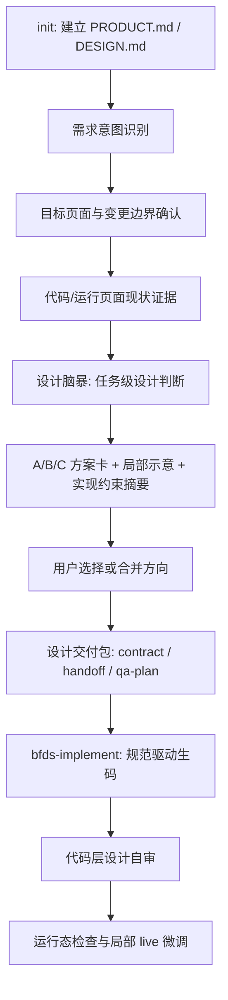

# BFDS 设计规范驱动生码闭环实施计划

## Summary

本计划纠偏 `bfds-design` 和 `bfds-implement` 的产品主线：BFDS 的核心价值不是生成三套完整设计稿，而是在 `DESIGN.md` 设计规范指导下，结合需求和代码现状，生成可执行的设计决策，并驱动代码 agent 生码、自审和局部微调。

旧流程里的 `init`、设计脑暴、A/B/C 用户选择和设计交付包都保留，但它们的目标统一改为服务高质量生码。设计稿降级为中间校准物，用于让用户理解“接下来会按哪个方向生码”，不是最终事实源。

---

## Problem Frame

现有 BFDS 主线更像“设计补全层”：先通过 Impeccable `init` 生成 `PRODUCT.md` / `DESIGN.md`，再确认目标界面，做设计脑暴，生成 A/B/C 三个 HTML 方案，用户选择后生成设计交付包，最后由 `bfds-implement` 实现。

这条主线不是一无是处。`init` 能建立项目语境和设计规范，设计脑暴能避免模型直接拼组件，A/B/C 给用户保留设计选择权，交付包让实现不依赖聊天记忆。问题在于旧流程把“三方案设计稿”放得过重，导致模型、用户和后续实现都围着中间产物转。

新的产品目标是：在设计系统指导下更准确地生码。唯一设计规范事实源是 `DESIGN.md`；实现阶段必须结合代码现状，生成符合需求、视觉一致、遵守 `DESIGN.md` 的代码；实现后还要做代码层设计自审，并支持类似 Impeccable live 的局部设计微调。

因此 BFDS 需要从“设计稿驱动”转为“设计规范驱动的生码闭环”。设计稿仍有价值，但它只负责预期对齐：告诉用户后续代码会往哪个方向做，哪些区域会变，哪些区域不会变。

---

## Target Definition

BFDS 的目标锁定为：

> BFDS 是面向前端代码生成的设计规范执行层：它把 `DESIGN.md`、用户需求和代码现状转化为可实现的设计决策，并驱动代码 agent 生成、审查和微调符合设计系统的高保真前端代码。

事实源优先级固定为：

```text
DESIGN.md
→ design-contract.json
→ implementation-handoff.md
→ 当前代码与运行页面证据
→ PRODUCT.md
→ 局部方案示意
→ 聊天记录
```

`DESIGN.md` 回答“应该长什么样”。`design-contract.json` 和 `implementation-handoff.md` 回答“本次需求选了哪个方向、允许改哪里、禁止改哪里”。代码和运行页面证据回答“现在怎么实现、哪些组件和样式要复用”。局部方案示意只帮助用户选择方向，不作为实现阶段的最高事实源。

---

## Requirements

- R1. `DESIGN.md` 必须成为两个 skill 的唯一设计规范事实源；任何方案、代码、自审和微调都不能绕开它发明新视觉系统。
- R2. `init` 环节必须保留，并重新定位为“设计规范建模”：`PRODUCT.md` 提供业务语境，`DESIGN.md` 提供视觉与组件规范。
- R3. 设计脑暴必须保留为必经核心阶段，用来蒸馏任务级设计判断，而不是为三套 HTML 补文案。
- R4. 设计脑暴不能被模型静默跳过；上下文足够时可以压缩为“判断并确认”，但仍要形成 `brainstorm-dialogue.json` 和 `directions.json`。
- R5. A/B/C 必须保留用户选择权，但输出形态从“三套完整页面设计稿”改为“方案卡 + 局部示意 + 实现约束摘要”。
- R6. 局部示意图或局部预览只服务预期对齐，不承担最终高保真验收；最终高保真在真实代码运行后通过自审、截图检查和 live 微调闭环。
- R7. `bfds-design` 的核心职责是生成设计决策与实现约束，不再是完整设计稿生产器。
- R8. `bfds-implement` 的核心职责是按 `DESIGN.md`、设计交付约束和代码现状高保真生码，并执行代码层设计自审。
- R9. 修改现有页面时，未改区域必须由目标界面证据和变更边界约束保护，不能让方案示意或实现阶段重画无关区域。
- R10. 用户不应手写结构化 JSON；runtime 继续负责 schema、状态、校验和产物展开，模型只提交设计判断和用户确认。
- R11. 热路径要短：next-card 和 `SKILL.md` 只放当前阶段动作和关键 gate；复杂规则留在 reference，并且只有卡片要求时读取。
- R12. 新流程必须减少运行时大模型负担：少生成完整 HTML、少读长上下文、少跨文件同步、少重复确认、少因中间设计稿失真返工。

---

## Key Technical Decisions

- KTD1. 产品主线改为规范驱动生码闭环：两个 skill 不再围绕“设计稿是否完整”评估成功，而围绕“最终代码是否符合需求、`DESIGN.md` 和选中设计决策”评估成功。
- KTD2. 保留旧流程的高价值交互：`init`、设计脑暴、A/B/C 选择和设计交付包都保留，因为它们分别解决规范来源、设计判断、用户校准和实现记忆问题。
- KTD3. 设计脑暴是硬 gate：`NEEDS_DIRECTIONS` 必须先产出 `brainstorm-dialogue.json`，再产出 `directions.json`；没有方向证据不能进入方案卡、选择或交付包。
- KTD4. 脑暴必须绑定实现：每个方向除了设计意图，还要写出 `DESIGN.md` 规则引用、代码复用假设、允许变更边界、实现风险和自审检查点。
- KTD5. 轻量方案替代完整页面设计稿：P0 继续兼容现有 `workbench.html`、`option-a.html`、`option-b.html`、`option-c.html` 路径，但内容降级为局部方案预览和方案卡，不再要求三套完整页面。
- KTD6. 高保真后移到实现闭环：实现后的真实页面截图、代码设计自审和 live 微调，比中间 HTML 更接近最终价值。
- KTD7. 运行态证据计划作为并行增强：问题 4 的页面证据、URL 阻断和局部 baseline 方案与本计划兼容，但本计划先锁定产品主线和 skill 职责。

---

## High-Level Flow



### Stage Intent

- `init`：拿到可信 `DESIGN.md`，不是为了写背景文档。
- 需求意图识别：判断是否属于 BFDS 的前端设计到生码闭环，不扩产品和后端。
- 目标页面与变更边界确认：明确哪里会变、哪里不能变。
- 现状证据获取：让设计判断和生码基于真实代码与页面现状。
- 设计脑暴：用顶级设计师判断把需求转成可选实现方向。
- 轻量方案确认：让用户知道生码后大概会怎样，不生产三套完整页面。
- 设计交付包：把用户选择变成代码 agent 可执行约束。
- 规范驱动生码：按 `DESIGN.md`、选中方向和代码现状实现。
- 代码层设计自审：检查实现是否偏离规范、方向和边界。
- 运行态检查与 live 微调：用真实页面闭环，而不是继续打磨中间稿。

---

## Design Brainstorm Contract

设计脑暴是融合流程的灵魂，必须被 runtime gate 保护。

### Inputs

设计脑暴读取这些信息：

- `PRODUCT.md`：业务语境、用户、品牌人格、反参考。
- `DESIGN.md`：视觉系统、组件规则、布局密度、状态表达、动效规则。
- `evidence/surface.json`：目标界面、改动类型、keep/change/avoid。
- 代码或运行页面证据：现有组件、样式 token、页面结构和局部边界。

### Required Behavior

- 默认 1-2 轮，每轮 2-3 个高价值问题。
- 上下文明确时使用“我判断为 X，确认吗？”而不是展开长问卷。
- 至少覆盖两个不同专业维度，例如主行动、用户心智、内容范围、状态边界、局部保留、可访问性。
- 每轮问答必须记录 `dimension`、`designImplication`、`designSystemImplication` 和 `implementationImplication`。
- 用户明确拒绝追问时，允许 `mode: "user-skipped"`，但仍要先提出 2-3 个方向取舍并取得用户确认。
- 模型不能因为需求看似清楚而直接写 `directions.json`。

### Direction Shape

每个方向至少包含：

```json
{
  "optionId": "A",
  "name": "低干扰风险提示",
  "designThesis": "在不破坏列表密度的前提下，把风险作为二级状态露出。",
  "differenceDimensions": ["hierarchy", "stateTreatment"],
  "designSystemRules": ["复用 DESIGN.md 中的 Tag/Badge 状态规则"],
  "codeReuseHypothesis": ["优先复用现有列表行组件和状态 token"],
  "allowedChangeBoundary": "只改持仓列表行内标签区域和相邻列宽",
  "implementationRisk": "low",
  "selfReviewChecks": [
    "未新增 DESIGN.md 之外的颜色",
    "未改变顶部导航、筛选栏和分页区域",
    "风险标签在典型、长文案和空状态下不挤压主信息"
  ]
}
```

三个方向必须在信息层级、密度、状态表达、交互反馈、局部保留范围或实现策略上有真实差异。换色、换圆角、换阴影不算方向差异。

---

## Lightweight Proposal Shape

A/B/C 环节保留，但用户看到的是生码方向校准物。

每个方案包含：

- 方案名称和一句设计意图。
- 局部 before/after 示意，优先基于当前页面截图或目标区域结构。
- `DESIGN.md` 规则引用。
- 会改哪些组件、样式或文件。
- 不会改哪些页面区域。
- 实现复杂度和视觉一致性风险。
- 实现后自审检查点。

P0 可以继续使用当前工作台路径：

```text
docs/design/<slug>/
  workbench.html
  option-a.html
  option-b.html
  option-c.html
```

但 `option-a.html`、`option-b.html`、`option-c.html` 的语义改为局部方案预览页，不再默认承诺完整页面高保真。局部改造场景中，未改区域应来自截图基底或明确锁定区域；没有运行态证据时，只能标记为低置信方向示意。

---

## Implementation Units

### U1. 产品定位与入口文案纠偏

- **Goal:** 把 README、两个 `SKILL.md` 和 agent 可见流程文案从“设计稿驱动”改为“`DESIGN.md` 规范驱动生码闭环”。
- **Files:** `README.md`, `skills/bfds-design/SKILL.md`, `skills/bfds-implement/SKILL.md`, `agents/openai.yaml`.
- **Patterns:** 保持 `SKILL.md` 精简，只写触发范围、核心流程、硬停止和 reference 导航。
- **Test Scenarios:** 前向测试覆盖“开始设计”“实现已确认方案”“缺设计交付包不能实现”“普通 bug 修复不触发 BFDS”。

### U2. 设计脑暴 reference 与 schema 强化

- **Goal:** 防止模型跳过脑暴，并把脑暴输出绑定到 `DESIGN.md`、代码复用和实现自审。
- **Files:** `skills/bfds-design/references/design-brainstorm.md`, `src/runtime/bfds/schemas/brainstorm-dialogue.schema.json`, `src/runtime/bfds/schemas/directions-evidence.schema.json`, `src/runtime/bfds/cli.mjs`, `src/runtime/bfds/scripts/bfds-gate.mjs`.
- **Patterns:** 复用当前 `NEEDS_DIRECTIONS` gate；新增字段应由 runtime 校验，用户不手写 JSON。
- **Test Scenarios:** 少于两轮有效问答不能 finalize；缺 `designSystemImplication` 不能 finalize；`directions.json` 缺实现风险或自审检查点不能进入下一阶段。

### U3. 轻量方案工作台改造

- **Goal:** 将评审工作台从三套完整页面设计稿改为方案卡、局部示意和实现约束摘要。
- **Files:** `skills/bfds-design/references/workbench-authoring.md`, `src/runtime/bfds/templates/kami-workbench/`, `fixtures/docs-design-sample/settings-prompt/`.
- **Patterns:** 保留现有工作台文件名以降低 runtime 迁移成本；改变内容语义和校验规则。
- **Test Scenarios:** workbench 能展示 A/B/C 方案卡；局部预览不得出现与 `directions.json` 不一致的方向；含 `BFDS_PLACEHOLDER` 仍不能进入选择阶段。

### U4. 设计交付包改为实现约束中心

- **Goal:** 让 `design-contract.json`、`implementation-handoff.md` 和 `qa-plan.json` 明确服务生码、自审和运行态检查。
- **Files:** `skills/bfds-design/references/contract-pack.md`, `src/runtime/bfds/schemas/design-contract.schema.json`, `src/runtime/bfds/schemas/qa-plan.schema.json`, `src/runtime/bfds/templates/artifacts/`.
- **Patterns:** `design-contract.json` 是机器权威合同；Markdown handoff 是实现入口；不要把关键规则只写进 Markdown。
- **Test Scenarios:** contract 必须包含 `DESIGN.md` 规则引用、允许变更边界、实现风险、自审检查点；缺用户明确选择不能生成交付包。

### U5. `bfds-implement` 生码与自审协议强化

- **Goal:** 把 `bfds-implement` 从“按设计稿写代码”改为“按 `DESIGN.md` 和设计约束高保真生码”。
- **Files:** `skills/bfds-implement/references/implementation-protocol.md`, `skills/bfds-implement/references/visual-fidelity-discipline.md`, `skills/bfds-implement/references/qa-protocol.md`, `skills/bfds-implement/references/live-region-iteration.md`, `skills/bfds-implement/references/impeccable-integration.md`.
- **Patterns:** 实现前读取 `DESIGN.md`、contract、handoff、qa-plan；实现后执行代码层设计自审，再进入运行态检查和 live 微调。
- **Test Scenarios:** 实现中硬编码 `DESIGN.md` 外颜色应被自审拦截；修改 keep 区域应被自审标为阻塞；无法运行页面时记录视觉 QA 不成立，不能假装通过。

### U6. Runtime 阶段卡与测试收口

- **Goal:** 让 next-card、schema 校验、fixture 和 forward tests 反映新主线，避免 agent 看旧卡片继续生成完整 HTML。
- **Files:** `src/runtime/bfds/cli.mjs`, `src/runtime/bfds/scripts/bfds-gate.mjs`, `tests/forward/`, `tests/pressure/RUNBOOK.md`, `fixtures/docs-design-sample/settings-prompt/`.
- **Patterns:** 状态枚举尽量不新增；优先复用 `NEEDS_DIRECTIONS`、`NEEDS_WORKBENCH`、`NEEDS_CONTRACT`，通过卡片文案和 schema 改变阶段职责。
- **Test Scenarios:** next-card 在 `NEEDS_DIRECTIONS` 明确要求脑暴；`NEEDS_WORKBENCH` 明确要求方案卡和局部示意；`NEEDS_CONTRACT` 明确要求实现约束回显。

### U7. 与运行态证据计划对齐

- **Goal:** 将本计划与 `docs/plans/bfds-design-runtime-evidence-impact-map-plan.md` 对齐，确保问题 4 的页面证据方案服务新主线。
- **Files:** `docs/plans/bfds-design-runtime-evidence-impact-map-plan.md`, future runtime evidence files under `src/runtime/bfds/`.
- **Patterns:** 本计划先锁定产品目标；运行态证据计划负责 URL 阻断、页面 capture、局部 baseline 和多页面影响图。
- **Test Scenarios:** 单页面单区域需求能从 URL 证据进入局部方案；多页面需求能记录 deferred 页面但只执行一个 active 切片。

---

## Acceptance Examples

- AE1. 用户要求“修改持仓列表新增风险标签”时，BFDS 先确认页面和区域，再做设计脑暴，输出 A/B/C 局部方案卡；用户选中后生成实现约束，`bfds-implement` 只改列表目标区域。
- AE2. 用户需求和 `DESIGN.md` 已经很明确时，模型不能跳过脑暴；它应提出“我判断本次应采用低干扰状态提示，确认吗？”并记录脑暴证据。
- AE3. 用户拒绝继续追问时，BFDS 记录 `mode: "user-skipped"` 和用户原话，但仍要提出方向取舍并等待用户确认，不能直接生码。
- AE4. 实现阶段新增了 `DESIGN.md` 之外的颜色、圆角或阴影时，代码层设计自审必须报出偏离并要求修正。
- AE5. 局部改造场景中，A/B/C 不应重画整个页面；未改区域应作为截图基底、锁定区域或明确的 keep 约束存在。
- AE6. 缺少 `design-contract.json`、`implementation-handoff.md` 或 `qa-plan.json` 时，`bfds-implement` 不得凭聊天记忆写代码。

---

## Reduce-Burden Review

本计划符合 AGENTS.md 的减负原则，但实施时必须守住边界。

减少负担的点：

- 不再默认生成三套完整 HTML 页面，减少模型生成成本、用户审查成本和设计稿维护成本。
- 设计脑暴保留为高价值交互，但默认 1-2 轮，每轮 2-3 个问题，不做长问卷。
- 用户只确认判断和方向，不手写 JSON；runtime 负责结构化产物和校验。
- `DESIGN.md` 成为统一事实源，减少方案、实现和 QA 对设计规则的重复解释。
- 局部示意只服务方向确认，最终高保真交给真实代码、自审和 live 微调。

需要避免的反模式：

- 不把 Impeccable 或 Product Design 的长 reference 全塞进 BFDS 热路径。
- 不新增多份并列事实源；`directions.json` 是方向证据，`design-contract.json` 是实现合同，二者职责不能重叠。
- 不为了“顶级设计师能力”增加机械问卷；问题必须从 `DESIGN.md`、需求和现状证据中动态生成。
- 不让局部示意图升级为新的高成本设计稿资产。
- 不在 skill 目录新增 README、术语表或安装指南类文档。

---

## Risks & Dependencies

- 过度纠偏风险：如果只强调生码，脑暴可能退化成工程实现计划。U2 必须把设计判断字段和 gate 做硬。
- 产物语义迁移风险：当前 workbench 文件名暗示完整方案 HTML。U3 需要明确“路径兼容，语义降级”，避免用户误以为这是最终高保真稿。
- 双事实源风险：`DESIGN.md`、`directions.json`、`design-contract.json`、handoff 可能重复。实施时必须规定 `DESIGN.md` 是规范源，contract 是本次需求合同，handoff 是人读入口。
- 页面证据依赖风险：问题 4 的运行态证据能力尚未实现时，局部示意只能低置信。计划必须允许先落主线，再接入 evidence capture。
- 自审质量风险：代码层设计自审如果只看 lint/test，会漏掉视觉偏差。U5 需要引入设计规则检查、文件 diff 审查和运行态截图检查。

---

## Sources

- `README.md`
- `docs/bfds-mvp-design-spec.md`
- `skills/bfds-design/SKILL.md`
- `skills/bfds-design/references/design-brainstorm.md`
- `skills/bfds-design/references/workbench-authoring.md`
- `skills/bfds-design/references/contract-pack.md`
- `skills/bfds-implement/SKILL.md`
- `skills/bfds-implement/references/implementation-protocol.md`
- `skills/bfds-implement/references/visual-fidelity-discipline.md`
- `vendor/impeccable/.agents/skills/impeccable/reference/init.md`
- `vendor/impeccable/.agents/skills/impeccable/reference/shape.md`
- `vendor/impeccable/.agents/skills/impeccable/reference/product.md`
- `vendor/impeccable/.agents/skills/impeccable/reference/critique.md`
- `vendor/impeccable/.agents/skills/impeccable/reference/live.md`
